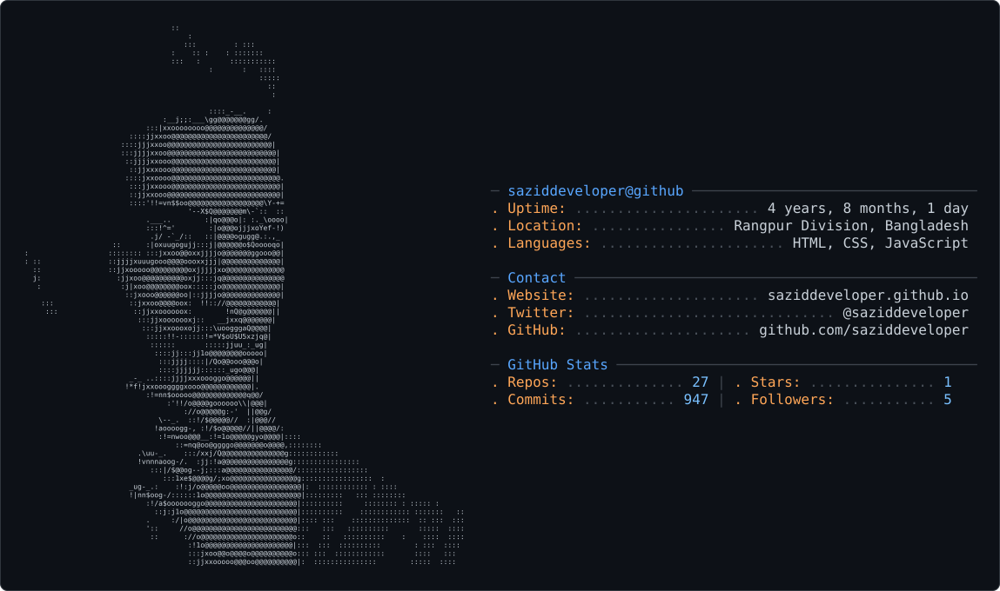

# SAZIDDEVELOPER Portfolio

A high-performance, cinematic developer portfolio web application built with **React**, **Vite**, **Tailwind CSS**, **GSAP**, and **Lenis Smooth Scroll**. Designed with modern dark-mode aesthetics, rich micro-interactions, scroll-driven parallax effects, and ultra-responsive mobile viewports.

---

<picture>
  <source media="(prefers-color-scheme: dark)" srcset="dark_mode.svg" />
  <source media="(prefers-color-scheme: light)" srcset="light_mode.svg" />
  
</picture>

---

## ✨ Features

- 🎬 **Cinematic Motion & Animations**: GSAP ScrollTrigger timeline reveals, letter-scramble preloader, and smooth image parallax depth.
- 🌊 **Inertial Smooth Scrolling**: Powered by Lenis smooth scroll engine with custom exponential deceleration curves synchronized to GSAP's ticker loop.
- 📱 **Fully Responsive & Scalable**: Optimized for all device viewports (desktop, tablets, and mid-range mobile devices down to 320px).
- 💼 **Featured Project Showcase**: Alternating project grid layout with tech stack badges, live demo links, and GitHub repository links.
- 🛠️ **Process Workflow Cards**: Interactive step-by-step development process breakdown (`Define` → `Design` → `Build` → `Launch`).
- 📧 **Direct Contact Integration**: Integrated contact section featuring EmailJS form submission capabilities and direct social links.

---

## 🛠️ Tech Stack

| Category | Technologies Used |
| :--- | :--- |
| **Core Frontend** | React 19, JavaScript (ES6+), HTML5 |
| **Styling & Design** | Tailwind CSS v4, Modern CSS Glassmorphism |
| **Animation & Physics** | GSAP 3 (GreenSock), ScrollTrigger, Lenis Smooth Scroll |
| **Form Services** | EmailJS Browser Integration |
| **Build & Tooling** | Vite, PostCSS, ESLint, Node.js |

---

## 📁 Project Structure

```text
portfolio/
├── public/
│   └── favicon.svg
├── src/
│   ├── assets/              # Project images, graphics, and video assets
│   ├── components/          # Reusable UI components
│   │   ├── Navbar.jsx       # Floating navbar with mobile drawer overlay
│   │   ├── Hero.jsx         # Scramble text preloader & hero graphic
│   │   ├── About.jsx        # Bio, interactive text reveal & skills marquee
│   │   ├── Services.jsx     # Development process cards & services accordion
│   │   ├── Project.jsx      # Featured project showcase & live demo links
│   │   ├── Contact.jsx      # Contact info & EmailJS contact form
│   │   └── Footer.jsx       # Branding footer & social links
│   ├── hooks/
│   │   └── useLenis.js      # Lenis smooth scroll + GSAP ScrollTrigger sync hook
│   ├── App.jsx              # Main app entry layout
│   ├── index.css            # Custom CSS & marquee keyframe animations
│   └── main.jsx             # React DOM root render
├── index.html               # Main HTML template
├── package.json             # Dependencies & scripts
└── vite.config.js           # Vite dev server configuration
```

**Title:** Ashaduzzaman Sazid — Full Stack Developer

**Source:** [https://saziddeveloper.github.io/](https://saziddeveloper.github.io/)

---

# Page Structure Map
```text
Ashaduzzaman Sazid — Full Stack Developer
├── Intro
├── Intro
│   └── OUR DEVELOPMENT PROCESS
│       ├── Define
│       ├── Design
│       ├── Build
│       └── Launch
├── WHAT I
│   ├── FULL STACK WEB DEVELOPMENT
│   ├── CROSS-PLATFORM MOBILE DEVELOPMENT
│   ├── 3D INTERACTIVE & CANVAS ANIMATIONS
│   ├── BACKEND ARCHITECTURE & DATABASES
│   └── E-COMMERCE & BUSINESS PLATFORMS
└── Selectedwork
    ├── TALKING VIDEO
    ├── SPICE WITH
    ├── EDITORIAL
    ├── BESPOKE
    ├── HXNI
    ├── NIXH
    ├── TICKET
    ├── NIXH FOOD
    ├── HXNI
    ├── HXNIX
    └── 3D INTERACTIVE
```

---

## Intro

## Intro

Hey, I'm Ashaduzzaman Sazid. A Full-Stack Developer specializing in building scalable web applications, softwares and apps using React, React Native, Node.js, MySQL, MongoDB, and Supabase. I focus on delivering clean code, pixel-perfect UI/UX design, and production-ready digital experiences.

### OUR DEVELOPMENT PROCESS

01

#### Define

Understanding your goals, user requirements, and technical constraints to lay a rock-solid foundation for the project.

02

#### Design

Creating intuitive, pixel-perfect user interfaces and wireframes that guarantee an engaging and accessible user experience.

03

#### Build

Developing scalable frontend architectures and secure backend systems using the latest modern tech stack.

04

#### Launch

Rigorous testing, performance optimization, and seamless deployment to cloud infrastructure followed by ongoing support.

## WHAT I  
CAN DO

01

### FULL STACK WEB DEVELOPMENT

02

### CROSS-PLATFORM MOBILE DEVELOPMENT

03

### 3D INTERACTIVE & CANVAS ANIMATIONS

04

### BACKEND ARCHITECTURE & DATABASES

05

### E-COMMERCE & BUSINESS PLATFORMS

## Selectedwork

As a frontend developer using modern ideas, simplicity design and universal visual identification tailored to dedicated and current market.

01

### TALKING VIDEO  
Portfolio

AI Video & Interactive Web ExperienceReact, Framer Motion, AOS, Tailwind CSS, Vercel

An interactive video portfolio platform featuring real-time talking presenter videos, dynamic motion animations, smooth scroll interactions, and modern web presentation.

Live DemoGitHub Code

02

### SPICE WITH  
Hassan

Boutique Restaurant & Ordering ManagementReact Native, Node.js, Express, MySQL

A full-stack restaurant management and food ordering application featuring dish customization, interactive menu browsing, live order tracking, and clean database architecture.

Live RepositoryGitHub Code

03

### EDITORIAL  
Excellence

Full-Stack Boutique E-commerce PlatformReact, Node.js, Express, MySQL, Tailwind

Modern full-stack e-commerce web application featuring comprehensive product management, shopping cart functionality, user checkout, and robust database structure.

Live RepositoryGitHub Code

04

### BESPOKE  
E-Store 2.0

Luxury Minimalist Mobile CommerceReact Native, Expo, Node.js, REST API

Cross-platform mobile e-commerce platform offering an intuitive minimalist UI, product catalog, cart flows, and seamless checkout experience.

Live RepositoryGitHub Code

05

### HXNI  
Express

Cinematic Parallax Food Delivery ExperienceReact Native, Expo, GSAP, Parallax Scroll

Mobile food delivery app built with cinematic parallax animations, smooth scroll interactions, and modular React Native components.

Live RepositoryGitHub Code

06

### NIXH  
Social Engine

Enterprise Multi-User Directory & Social EngineReact Native, Firebase, Node.js, REST API

Scalable social directory mobile application featuring user authentication, user profiles, search, real-time messaging, and multi-user interactions.

Live RepositoryGitHub Code

07

### TICKET  
Verse

Premium Full-Stack Event Booking EngineReact Native, Node.js, Express, MySQL

Full-stack event ticket booking platform featuring seat selections, digital ticket generation, secure checkout, and event management dashboard.

Live RepositoryGitHub Code

08

### NIXH FOOD  
2.0 Ecosystem

Scalable Order Tracking & Delivery EcosystemReact Native, Node.js, Express, REST API

End-to-end food ordering and delivery ecosystem with real-time order status tracking, kitchen updates, and streamlined user navigation.

Live RepositoryGitHub Code

09

### HXNI  
Finance

Advanced Personal Asset & Expense ManagementReact Native, Node.js, MySQL, Chart.js

Comprehensive personal finance manager providing automated budget tracking, expense analytics, visual category breakdowns, and financial reporting.

Live RepositoryGitHub Code

010

### HXNIX  
Community App

Modern Interactive Community EngineReact Native, Firebase, Node.js, Express

Cross-platform mobile community app enabling real-time content sharing, user interaction, notifications, and profile customization.

Live RepositoryGitHub Code

011

### 3D INTERACTIVE  
Portfolio

Interactive 3D Web Portfolio ExperienceReact, Three.js, GSAP, Tailwind CSS

Immersive 3D interactive web portfolio showcasing projects with 3D model rendering, spatial navigation, dynamic lighting, and interactive animations.

Live RepositoryGitHub Code
